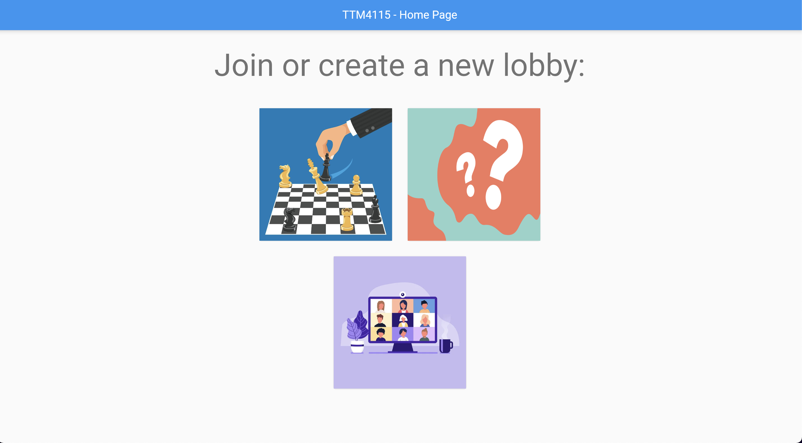

# TTM4115-project

## Table of contents
- [General info](#general-info)
- [Main file structure](#main-file-structure)
- [Link to web applicaiton](#link-to-web-applicaiton)
- [Constraints](#constraints)
- [Starting the quiz](#starting-the-quiz)

## General info
This project aims to create a communication device for members of a development team or office 
that is distributed in at least 2 office locations, together with persons working from home.
To solve this the group has created a web application that integrates Zoom and includes a quiz
and a chessboard.

## Main file structure
    .
    ├── backend                 # Files related for running the backend for the quiz
    ├── statemachines           # Files for the statemachines ran on the raspberry-pi
    ├── web                     # Files related for the flutter web application     

## Link to web applicaiton
[Web application](http://ttm4115-quiz-backend.herokuapp.com/#/)

## Constraints
- Since the mqtt protocol we have implemented uses websockets you have to use http and not https.
- Google chrome does not support the web sockets, please use another browser such as Mozilla Firefox.

## Starting the quiz
In order to start the quiz an empty post request has to be sent to /room, which creates a quiz room with 10 questions. 
This is because one of our ideas was to implement multiple concurrent quiz rooms where players could join, 
but we simplified the idea to just be one main quiz with a leaderboard. 
